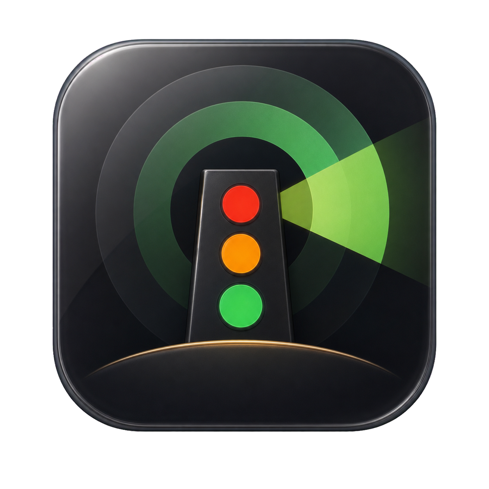
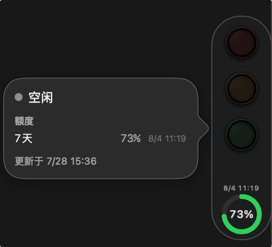
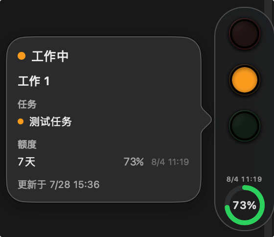
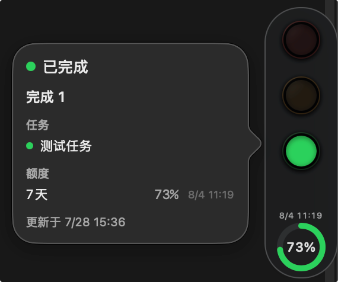

# Codex Beacon

<p align="center">
  
</p>

[中文文档](README.md)

Codex Beacon is a native macOS companion for Codex Desktop. It shows the aggregate state of your Codex Desktop tasks with a traffic-light-style indicator, with your current account quota at the edge.

It fails closed: when current, reliable Desktop runtime evidence is unavailable, it shows **Monitoring unavailable** rather than treating that condition as idle.

## Download

[Download Codex Beacon 1.0.7](https://github.com/lindengjian/CodexBeacon/releases/tag/v1.0.7)

The release page includes the Apple Silicon DMG and its SHA-256 checksum.

### Requirements

- macOS 15 or later
- Apple Silicon Mac
- Codex Desktop installed locally

### Install

1. Download and open `CodexBeacon-1.0.7-arm64.dmg`.
2. Drag **Codex Beacon** to **Applications**.
3. Open Codex Beacon from Applications. If macOS asks you to confirm opening it, follow the system prompt.

On first launch, Beacon checks the local Codex Desktop integration, requests notification permission, and offers **Launch at Login**. It then runs as an accessory application without a Dock icon or menu-bar item.

### One-line install

No Node.js is required. Open Terminal, paste this line, and press Return:

```sh
curl -fsSL https://raw.githubusercontent.com/lindengjian/CodexBeacon/main/scripts/install.sh | bash
```

The command downloads the latest version from the official GitHub Release, checks the downloaded package and verifies the app signature, installs it at `~/Applications/CodexBeacon.app`, and opens it. It does not bypass macOS security confirmation; follow the system prompt if macOS asks you to confirm opening the app.

## What it shows

| Idle | Working | Completed |
| :---: | :---: | :---: |
|  |  |  |
| All task lamps are off. | The amber lamp breathes. | The green lamp stays lit until confirmed. |

| State | Signal | Meaning |
| --- | --- | --- |
| Monitoring unavailable | Steady red | Desktop monitoring evidence is missing, stale, or incompatible. |
| Approval | Flashing green | A task needs approval, authorization, or an answer. |
| Working | Breathing amber | At least one task is active. |
| Completed | Steady green | At least one successful completion has not been confirmed. |
| Idle | All lamps off | No approval, active, or unconfirmed-completion task remains. |

When tasks differ, this order determines the displayed signal. With macOS **Reduce Motion** enabled, animations stop; Approval uses a double green ring so it remains distinct from Completed.

## Features

- Monitors **Codex Desktop tasks only**; CLI, IDE-extension, and remote tasks are excluded.
- Keeps a small floating panel visible across Spaces and eligible full-screen apps, with edge snapping and no Dock or menu-bar presence.
- Opens or focuses the relevant Codex task when clicked, then confirms existing completions.
- Shows aggregate task counts, quota windows, reset times, update time, and monitoring errors on hover. Task titles are hidden by default.
- Selects the shortest currently reported quota window automatically; it does not assume a fixed five-hour or weekly window.
- Alerts on a confirmable quota reset with a notification, optional sound, a five-second frame pulse, and a temporary message. Nearby resets are combined into one alert.
- Supports standard (`62 × 229 pt`) and compact (`24 × 88 pt`) sizes, a configurable global shortcut, launch at login, and separate sounds for Approval, Completed, and quota reset.

## Planned support

- [ ] Windows support.
- [ ] Light and dark appearance switching.
- [ ] Custom themes and skins.

## Use

- **Click** to open or focus the oldest task requiring approval; otherwise, a completed or working task. The click also confirms existing completions.
- **Hover** to see state counts, quota windows, reset times, last update, and availability errors.
- **Drag** to any screen edge. Left and right edges are vertical; top and bottom edges are horizontal.
- **Right-click** for Settings, temporary hide/show, or quit.
- Press **Control + Option + Command + C** to show or hide Beacon; change the shortcut in Settings if needed.

## Local integration

Beacon passively observes the local Codex App Server and never resumes or changes a task, answers approval/input requests, or reads private transcripts. If Settings reports **Monitoring unavailable**, run the diagnostic and select **Repair integration** only when it is offered; then fully quit and reopen Codex Desktop before running the diagnostic again.

You can restore the default Desktop integration from Settings at any time.

## Privacy

Beacon communicates only with the local Codex App Server. It has no telemetry, crash reporting, cloud sync, or automatic-update check.

Its local diagnostic trace records connection lifecycle and protocol/status metadata, but not raw App Server JSON, task IDs or titles, account fields, or local paths. It leaves the Mac only when you explicitly export a timestamped copy from Settings.

## Development

Development requires Xcode 16 or later. From the repository root:

```sh
# Run the test suite
swift test

# Assemble a release application bundle at .build/CodexBeacon.app
./scripts/build-app.sh

# Run npm installer tests
npm test --prefix npm

# Build and inspect the npm package that would be published
npm run pack:check --prefix npm
```

## Learn more

See [the acceptance record](docs/acceptance/first-local-milestone.md) for compatibility checks and the macOS window matrix, and [docs/PRODUCT.md](docs/PRODUCT.md) for product details and scope. Source code and all official releases are available at [lindengjian/CodexBeacon](https://github.com/lindengjian/CodexBeacon).
